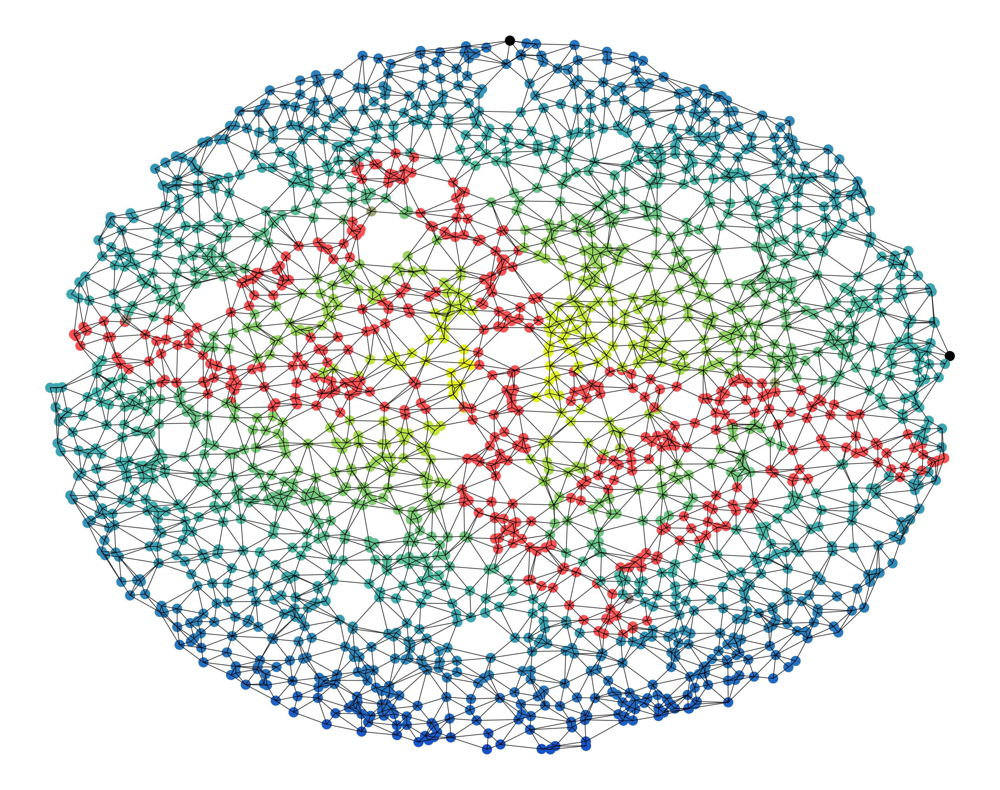
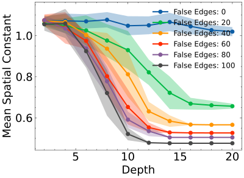
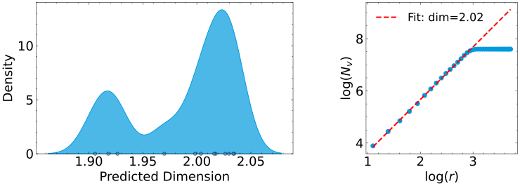
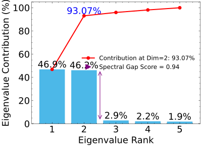
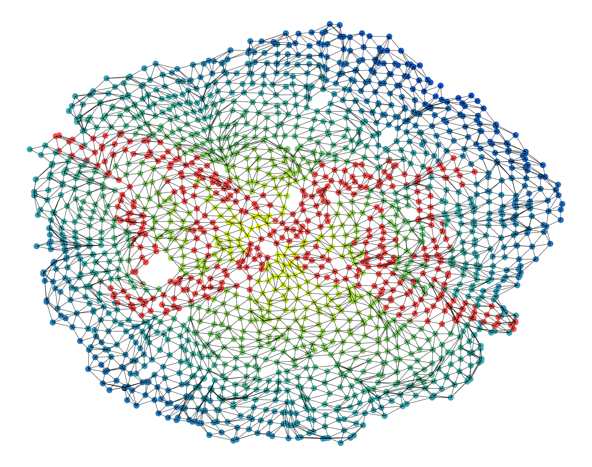
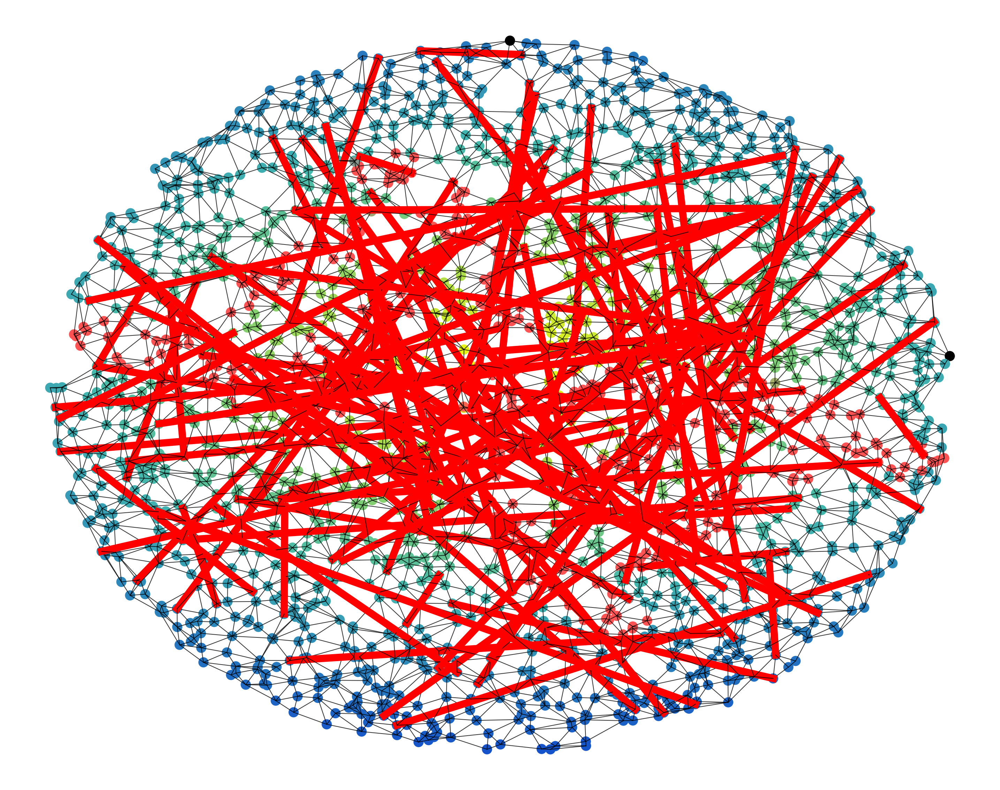
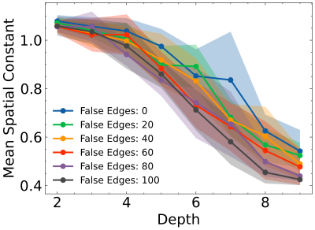
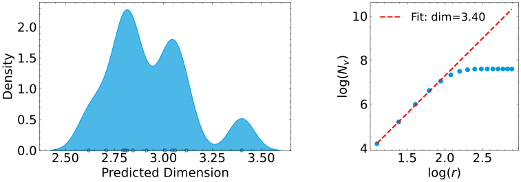
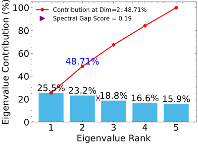

# Network Spatial Coherence
How spatially coherent is your network? This package, network spatial coherence, answers the question by checking how Euclidean the network is - how close it is to a physical network.
We do this by measuring 3 different properties. The network can also be reconstructed approximately to its original positions using the STRND algorithm. 
Networks can be both simulated (if you do not have a network, imported (your network!) and weighted (if you know the strength of pairwise interactions). 

## Features
- Analyze the spatial coherence of a network
- Reconstruction images from purely network information
- Efficient graph loading and processing (using sparse matrices or getting a graph sample)
- Handles simulated graphs, custom graphs, unweighted graphs, weighted graphs


## Install
Python 3.11 is reccomended, although older versions should work.

```bash
pip install network_spatial_coherence
```

## Usage
For a detailed tutorial, see the [Jupyter Notebook Tutorial](./network_spatial_coherence/network_spatial_coherence_tutorial.ipynb) in this repository.

1. Access documentation for detailed API usage:

```python
from network_spatial_coherence.docs_util import access_docs
access_docs()
```

2. Example run

```python
import network_spatial_coherence.nsc_pipeline as nsc
from network_spatial_coherence.structure_and_args import GraphArgs

args = GraphArgs()
# define conditions for the run
args.spatial_coherence_validation['gram_matrix'] = True
args.spatial_coherence_validation['network_dimension'] = False
args.spatial_coherence_validation['spatial_constant'] = False

args.show_plots = True
args.colorfile = "dna_cool2.png"
args.plot_original_image = True
args.reconstruct = True
args.reconstruction_mode = 'STRND'
args.plot_reconstructed_image = True
# ---------

# create or load the graph
graph, args = nsc.load_and_initialize_graph(args=args)
# run spatial coherence for the graph, with optional reconstruction
single_graph_args, output_df = nsc.run_pipeline(graph, args)
# results are stored in a dataframe
print(output_df)
```

3. Using custom (your own!) graphs
Before using your own graph, make sure the edge list is in the 'data/edge_lists' directory.
```python
args.proximity_mode = "experimental"
args.edge_list_title = "your_graph_edge_list.csv"
graph, args = nsc.load_and_initialize_graph(args=args)
single_graph_args, output_df = nsc.run_pipeline(graph, args)
```
## Example Results
### Spatially Coherent Network

<table>
  <tr>
    <td></td>
    <td></td>
    <td></td>
    <td></td>
    <td></td>
  </tr>
</table>

### Incoherent Network

<table>
  <tr>
    <td></td>
    <td></td>
    <td></td>
    <td></td>
    <td></td>
  </tr>
</table>

## Further information
- [Directory Structure](directory_structure.md)
- [GraphArgs Configuration](graph_args.md)


## Contact
[dfb@kth.se]
